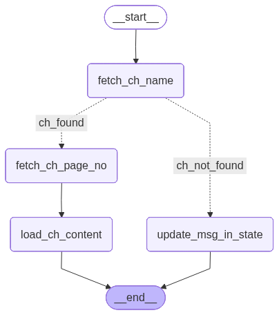
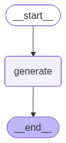

 

> [!WARNING]
> 
> - Due to free quota limits, embedding model can save upto 100 chunks only
> - so it's glue code is written in `faiss_manager.py`

 
 

## Problems and their Solutions

### 1) Page number disorder while loading chapter content, input of unwanted book pages.

Add a node in `ChapterContentLoader` subagent that tells the page number of first chapter
    and according to that exact content will be load.

### 2) Huge time while fetching a particular chapter.

Reason: Most use of Glue code
Solution: Use genunine methods to load a particular chapter content. Handle this situation on `PDFProcessor().load_pdf()` in `pdf_processor.py`
It will be descrease about ~20 seconds of latency.

### 3) Vector stores load 2 times, first while loading main agent and secod while loading rag in chapter content loader (subagent).

Reason: Beacuse `Podagent` (main) and `ch_loader_agent` (subagent) both need the RAG.
Solution: we can load RAG only a single time and it can be passed accessible to both main agent and subagent.

## Architectures

 
 

> Podagent Architecture (Main Agent)

 
 

> Chapter Content Loader Agent Architecture (Sub agent)

 
 

> Quiz Generator Agent Architecture (Sub agent)

